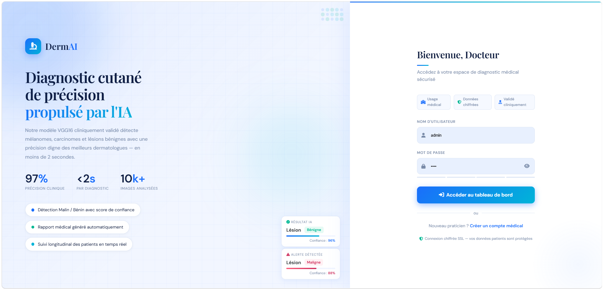
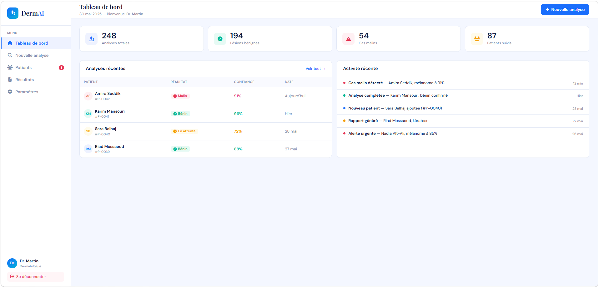
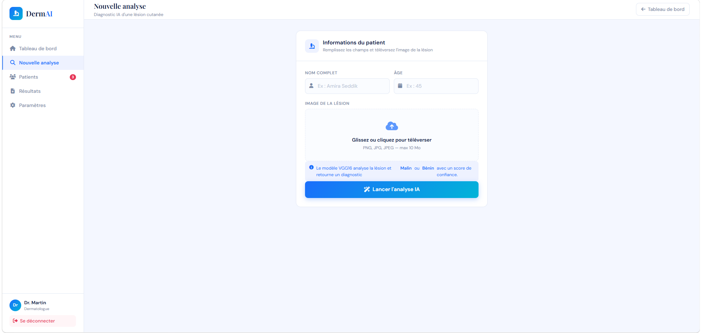
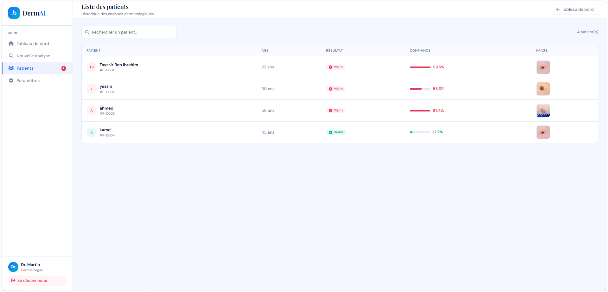
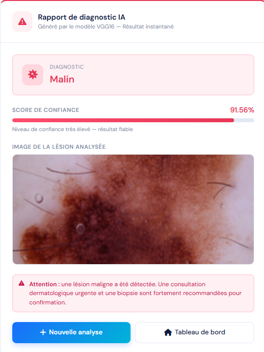

# DermAI — Skin Cancer Detector

> Application web de détection du cancer de la peau par intelligence artificielle, développée avec Flask et un modèle VGG16 fine-tuné.

---

## Modèle IA

- **Architecture** : VGG16 (Transfer Learning + Fine-tuning)
- **Tâche** : Classification binaire — Malin / Bénin
- **Précision** : ~94% sur le jeu de test
- **Framework** : TensorFlow / Keras
- **Entrée** : Image RGB 224×224 pixels

---

## Fonctionnalités

- Authentification sécurisée (Login / Register)
- Upload d'image de lésion cutanée
- Analyse IA instantanée avec score de confiance
- Tableau de bord avec statistiques
- Historique complet des patients
- Rapport de diagnostic détaillé

---

## Stack technique

| Composant | Technologie |
|-----------|-------------|
| Backend | Flask (Python) |
| Modèle IA | VGG16 — TensorFlow/Keras |
| Base de données | MySQL |
| Frontend | HTML5, CSS3, Bootstrap 5 |
| Icons | Font Awesome 6 |

---

## Installation

### Prérequis
- Python 3.10+
- MySQL (XAMPP ou standalone)
- pip

### Étapes

```bash
# 1. Cloner le repo
git clone https://github.com/tayssirbenibrahim686-sys/skin-cancer-detector.git
cd skin-cancer-detector

# 2. Installer les dépendances
pip install flask tensorflow pillow mysql-connector-python

# 3. Créer la base de données
# Importer dartabase.sql dans MySQL

# 4. Ajouter le modèle
# Placer vgg16_malignant_benign.h5 dans le dossier model/

# 5. Lancer l'application
python app.py
```

Accéder à : `http://127.0.0.1:5000`

**Compte par défaut :** `admin` / `admin`

---

## Structure du projet

```
SKIN_CANCER_APP/
├── app.py                          # Application Flask principale
├── dartabase.sql                   # Schéma de la base de données
├── model/
│   └── vgg16_malignant_benign.h5   # Modèle entraîné (non inclus)
├── static/
│   ├── style.css
│   └── uploads/                    # Images uploadées
└── templates/
    ├── login.html
    ├── dashboard.html
    ├── predict.html
    ├── result.html
    └── patients.html
```

---

## Aperçu

### Page de connexion


### Tableau de bord


### Nouvelle analyse


### Liste des patients


### Résultat du diagnostic


---

## Auteur

**Tayssir Ben Ibrahim**  
Étudiant ingénieur — ENSTA Borj Cedria, Université de Carthage  
Spécialité : Intelligence Artificielle & Electronique Avancée

---

## Licence

Projet académique — ENSTA Borj Cedria 2025/2026
